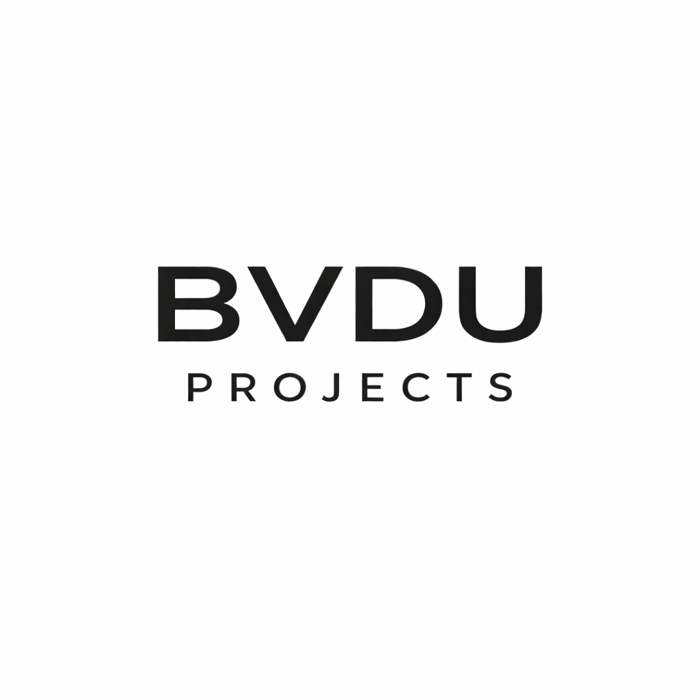

# BVDU Projects

  

**Collaborative academic engineering projects under the BVDU series, focused on system design, algorithms, and structured software development.**

## Current Projects

### 🏦 [BVDU-BANK](https://github.com/BVDU-Projects/BVDU-BANK)
Console-based Banking & Trading Management System written in C.

### 🚆 [BVDU-RailX](https://github.com/BVDU-Projects/BVDU-RailX)
Metro network simulation and routing engine built in C.

---

Focused on structured system design, algorithmic thinking, and practical implementation.
