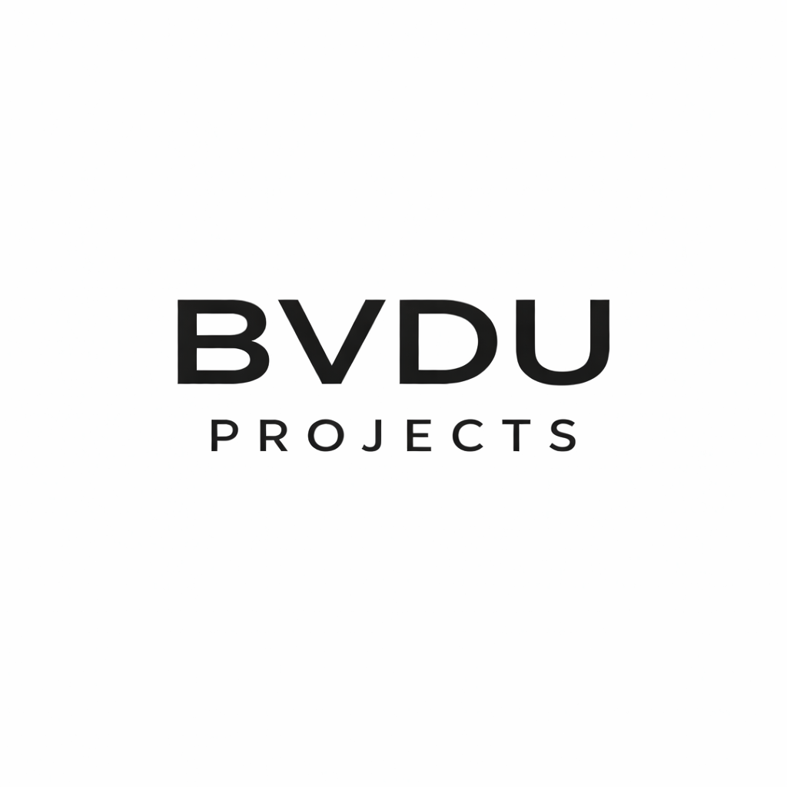

# BVDU Projects

  

**Collaborative academic engineering projects under the BVDU series, focused on system design, algorithms, and structured software development.**

## 🚀 Active Project

### 🛡️ [BVDU-SecQuery](https://github.com/BVDU-Projects/BVDU-SecQuery)
Local & Cloud Threat Intelligence Engine and Endpoint Malware Scanner in Python.

---

## 🏁 Completed Projects

### 🏦 [BVDU-BANK](https://github.com/BVDU-Projects/BVDU-BANK)
Console-based Banking & Trading Management System written in C.

### 🚆 [BVDU-RailX](https://github.com/BVDU-Projects/BVDU-RailX)
Multi-line rail network simulation and routing engine built in C.

---

Focused on structured system design, algorithmic thinking, and practical implementation.
